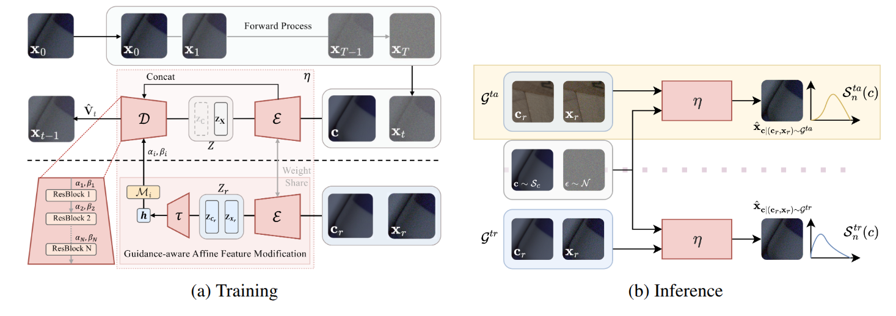

# GuidNoise: Single-Pair Guided Diffusion for Generalized Noise Synthesis
Changjin Kim, HyeokJun Lee, YoungJoon Yoo

Paper link : [[AAAI26]]() [[Arxiv]](https://arxiv.org/abs/2512.04456)


> **Abstract:** *Recent image denoising methods have leveraged generative modeling for real noise synthesis to address the costly acquisition of real-world noisy data. However, these generative models typically require camera metadata and extensive target-specific noisy-clean image pairs, often showing limited generalization between settings. In this paper, to mitigate the prerequisites, we propose a Single-Pair Guided Diffusion for generalized noise synthesis(GuidNoise), which uses a single noisy/clean pair as the guidance, often easily obtained by itself within a training set. To train GuidNoise, which generates synthetic noisy images from the guidance, we introduce a guidance-aware affine feature modification (GAFM) and a noise-aware refine loss to leverage the inherent potential of diffusion models. This loss function refines the diffusion model’s backward process, making the model more adept at generating realistic noise distributions. The GuidNoise synthesizes high-quality noisy images under diverse noise environments without additional metadata during both training and inference. Additionally, GuidNoise enables the efficient generation of noisy-clean image pairs at inference time, making synthetic noise readily applicable for augmenting training data. This self-augmentation significantly improves denoising performance, especially in practical scenarios with lightweight models and limited training data.*

## Table of Contents
- [Overview](#overview)
- [Prepare](#prepare)
- [Synthesize](#synthesize)
- [Denoise](#denoise)
- [Acknowledgement](#acknowledgement)

## Overview
<p align="center">
  
</p>

## Enviroments
```bash
git clone https://github.com/chjinny/GuidNoise.git
cd GuidNoise
pip install -r requirements.txt
```
Test enviroments
```yaml
Python : 3.8.20
Pytorch : 2.4.1+cu118
GPU : RTX A6000
CUDA : 11.8
CuDNN : 90100
```
Note on reproducibility: Due to GPU non-determinism, results may slightly vary across GPU models even with fixed random seeds. For reproduction, we provide the initial noise tensor.


## Synthesize
- [Dataset](https://drive.google.com/drive/folders/1aQYxRcHRflxBZZ7GT4NGsWqVZP_Tc6VG?usp=drive_link) 
- [Weight](https://drive.google.com/drive/folders/1R_8nOuyb47PfV7sEb5Zz8Oc2DuL2Yo9M?usp=drive_link)
```bash
python generate.py --config config_sidd_val.yaml
```

## Denoise
- [Dataset](https://drive.google.com/drive/folders/1qo7VCEaz8TRFphxqRc6ibiI2g9te8aIP?usp=drive_link)
- [Weight](https://drive.google.com/drive/folders/1MRJCc-TCioSTJ1oYA5-imvMKq7B-eYjZ?usp=drive_link)

```bash
python denoise.py \
  --mode validation \
  --checkpoint_path checkpoints/denoiser.pth \
  --valid_noisy_path data/ValidationNoisyBlocksSrgb.mat \
  --valid_gt_path data/ValidationGtBlocksSrgb.mat
```

```bash
python denoise.py \
  --mode benchmark \
  --checkpoint_path checkpoints/denoiser.pth \
  --benchmark_path data/BenchmarkNoisyBlocksSrgb.mat \
  --output_file SubmitSrgb.csv
```

## Acknowledgement
The codes are based on follows:
- [Denoising Diffusion Pytorch](https://github.com/lucidrains/denoising-diffusion-pytorch)
- [Differentiable Histogram](https://github.com/Yukun-Huang/pytorch-differentiable-histogram)
- [NAFlow](https://github.com/dongjinkim9/NAFlow)

We thank the authors for sharing their codes.
